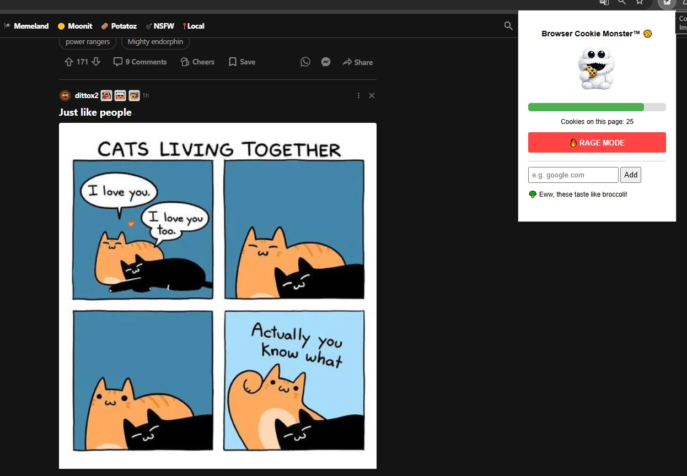

<p align="center">
  
</p>


# 🍪 Browser Cookie Monster™

An interactive, gamified tab-state privacy utility and active session manager for Google Chrome (Manifest V3). Keep track of system cookie retention through visual health metrics, deploy explicit real-time exclusion via the Broccoli Protocol™, or initiate global eviction sequences using the core Rage Mode™ framework.

Developed by **Tomislav Jurčević** (2026).

<p align="center">
  
</p>

## ⚠️ Intellectual Property & Commercial Licensing

This project is protected under a strict **Non-Commercial License Agreement**. It is **NOT** open-source under the MIT license anymore.

- **✅ Permitted Use**: Free for personal use, students, educators, hobbyists, and non-profit research.
- **❌ Prohibited Use**: Any deployment, modification, or inclusion within commercial entities, for-profit businesses, ad-supported sites, or as part of a paid service/extension is strictly prohibited without a valid Commercial License.

### 💼 Commercial Licensing Inquiries
If your organization wishes to use Browser Cookie Monster™ in a commercial environment, you must obtain a separate commercial license from the Author. 

For custom licensing terms, pricing inquiries, or enterprise deployment, please contact the Author directly via email:  
📩 **tjurcevicos@gmail.com**

---

## Architectural Features

- **Stochastic Hunger Engine**: An independent background worker continuously computes a persistent wellness index stored securely inside `chrome.storage.local`. To simulate organic behavior, the degradation cycle runs recursively via dynamic timeouts, selecting unpredictable intervals of 10, 20, or 30 seconds per health point reduction.
- **The Broccoli Protocol flesh™ (Smart Filtering)**: A localized infrastructure allowing users to isolate high-value domains (e.g., persistent login tokens, web application states) from manual or automated deletion arrays.
- **Rage Mode™ Engine**: A single-action batch removal sequence that completely purges non-whitelisted cookie assets on the active domain, complete with structural animation loops and localized audio playback.
- **Passive Eviction Handler**: Automated structural fallback scripts that trigger localized cookie reduction protocols whenever system health metrics breach critical operating zones (<30%).

## Directory Structure

```text
cookie-monster-extension/
├── manifest.json      # Cryptographic permissions and service routing
├── popup.html         # Front-end viewport and DOM skeleton
├── popup.js           # Event listeners, active queries, and local sync
├── background.js      # Stochastic timer matrices and automated passive checks
├── styles.css         # CSS Variables, interface layout, and scale keyframes
├── icon.png           # Proprietary branding graphics asset
├── chew.mp3           # Synchronized audio response binary
└── LICENSE            # Core legal and ownership structure
```

## Local Setup & Installation

1. Navigate to `chrome://extensions/` inside Google Chrome.
2. Enable the **Developer mode** toggle in the top right corner.
3. Click **Load unpacked** in the top left corner.
4. Select the localized root `cookie-monster-extension` directory containing these source files.
5. Click the puzzle icon in Chrome's application bar and **pin** Browser Cookie Monster™.

---

*See the accompanying `LICENSE` file for full legal restrictions, non-commercial constraints, and compliance information.*

---
---


<p align="center">
  
</p>

# 🍪 Browser Cookie Monster™

Interaktivni, gamificirani alat za privatnost stanja kartica i upravljanje aktivnim sesijama za Google Chrome (Manifest V3). Pratite stanje zadržavanja kolačića kroz vizualne pokazatelje zdravlja, koristite trenutačno izuzimanje putem Broccoli Protocol™ sustava ili pokrenite globalno čišćenje kolačića pomoću Rage Mode™ okvira.

Autor: **Tomislav Jurčević** (2026).

<p align="center">
  
</p>

## ⚠️ Intelektualno vlasništvo i komercijalno licenciranje

Ovaj projekt zaštićen je strogim **Ugovorom o nekomercijalnom korištenju**. Više nije dostupan kao otvoreni kod pod MIT licencom.

* **✅ Dopušteno korištenje:** Besplatno za osobnu upotrebu, studente, edukatore, hobiste i neprofitna istraživanja.
* **❌ Zabranjeno korištenje:** Svako korištenje, modificiranje ili uključivanje u komercijalne proizvode, profitne organizacije, stranice financirane oglašavanjem ili plaćene usluge/proširenja strogo je zabranjeno bez važeće komercijalne licence.

### 💼 Upiti za komercijalnu licencu

Ako vaša organizacija želi koristiti Browser Cookie Monster™ u komercijalnom okruženju, potrebno je pribaviti zasebnu komercijalnu licencu od autora.

Za prilagođene uvjete licenciranja, informacije o cijenama ili implementaciju u poslovnom okruženju kontaktirajte autora putem e-pošte:

📩 **[tjurcevicos@gmail.com](mailto:tjurcevicos@gmail.com)**

---

## Arhitekturne značajke

* **Stochastic Hunger Engine™**: Neovisni pozadinski proces kontinuirano izračunava trajni indeks dobrobiti pohranjen u `chrome.storage.local`. Kako bi ponašanje djelovalo prirodnije, ciklus degradacije koristi rekurzivne dinamičke vremenske odmake te nasumično bira intervale od 10, 20 ili 30 sekundi za svako smanjenje zdravlja.
* **Broccoli Protocol flesh™ (Pametno filtriranje)**: Lokalizirana infrastruktura koja korisnicima omogućuje zaštitu važnih domena (npr. prijavnih tokena ili stanja web aplikacija) od ručnog ili automatskog brisanja.
* **Rage Mode™ Engine**: Jednim klikom pokreće masovno uklanjanje svih kolačića koji nisu na popisu izuzetaka za aktivnu domenu, uz animacije i lokalnu reprodukciju zvuka.
* **Passive Eviction Handler™**: Automatizirani sigurnosni mehanizam koji pokreće lokalizirano smanjenje broja kolačića kada pokazatelji zdravlja sustava padnu ispod kritične razine (<30%).

## Struktura direktorija

```text
cookie-monster-extension/
├── manifest.json      # Dozvole proširenja i usmjeravanje servisa
├── popup.html         # Korisničko sučelje i DOM struktura
├── popup.js           # Event listeneri, aktivni upiti i lokalna sinkronizacija
├── background.js      # Stohastički mjerači vremena i automatske provjere
├── styles.css         # CSS varijable, raspored sučelja i animacije
├── icon.png           # Grafički identitet proširenja
├── chew.mp3           # Sinkronizirani zvučni efekt
└── LICENSE            # Pravna dokumentacija i uvjeti korištenja
```

## Lokalna instalacija

1. Otvorite `chrome://extensions/` u pregledniku Google Chrome.
2. Uključite opciju **Developer mode** u gornjem desnom kutu.
3. Kliknite **Load unpacked** u gornjem lijevom kutu.
4. Odaberite direktorij `cookie-monster-extension` koji sadrži izvorne datoteke projekta.
5. Kliknite ikonu slagalice u Chrome alatnoj traci i **prikvačite** Browser Cookie Monster™.

---

*Za potpune pravne informacije, ograničenja nekomercijalnog korištenja i uvjete usklađenosti pogledajte priloženu datoteku `LICENSE`.*
